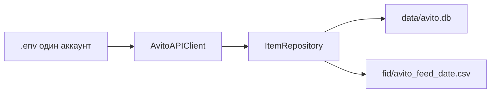
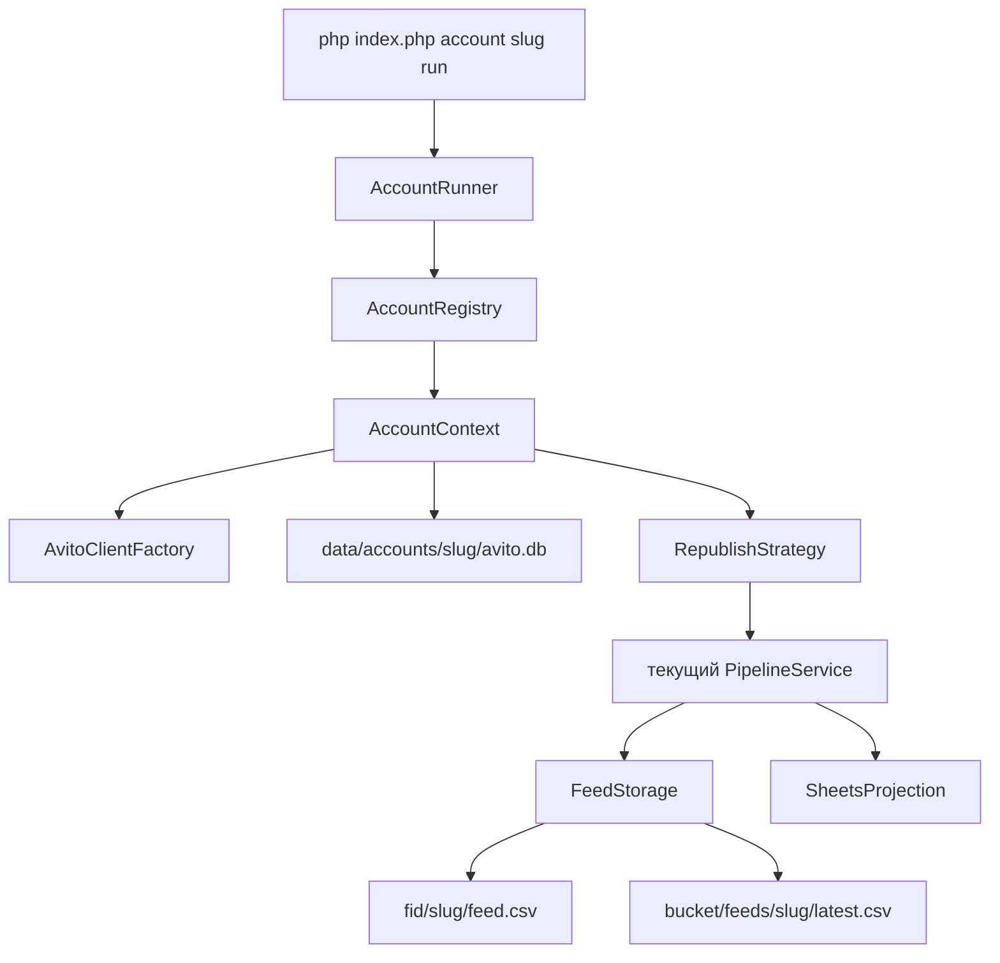

# Масштабирование на много аккаунтов Avito

Как обернуть текущий одноаккаунтный контур в контекст аккаунта, стратегии переопубликации, отдельную БД и фид на аккаунт, выгрузку в объектное хранилище и проекцию статистики в Google Sheets — без переписывания уже работающего пайплайна.

Код по этому документу не меняется, пока одноаккаунтный контур не стабилизирован. Ниже — целевая схема и порядок внедрения.

## Что есть сейчас

Один аккаунт зашит в четырёх местах:

- `.env` и [config/avito.php](../config/avito.php): один `AVITO_CLIENT_ID` / `SECRET` / `USER_ID`.
- [index.php](../index.php): один `PDO` на `data/avito.db`, один `AvitoAPIClient`, один `ItemRepository`.
- [src/Services/FeedGeneratorService.php](../src/Services/FeedGeneratorService.php): один файл `fid/avito_feed_YYYY-MM-DD.csv`. Дневной счётчик — глобальный ключ `app_meta.feed_repub_YYYY-MM-DD`.
- [src/Repositories/ItemRepository.php](../src/Repositories/ItemRepository.php): в `physical_ads`, `stats`, секциях `stats_YYYY_MM` и `republish_candidates_YYYY_MM` нет `account_id`. `avito_id` и `unique_id` живут в одном пространстве.

Уже есть зачатки нужных границ: сервисы (`PipelineService`, `AnalysisService`, `FeedGeneratorService`), репозиторий, DTO правил (`AnalysisRuleDTO`). Их не выбрасываем. `ItemRepository` (~1700 строк) остаётся внутри аккаунта: туда не добавляем мультиарендность построчно.

Автозагрузка сейчас только читает отчёт Авито (`GET /autoload/v4/uploads` в [AvitoAPIClient](../src/Services/AvitoAPIClient.php)). Выгрузки готового фида в облако в коде нет. Эндпоинт `POST /autoload/v1/.../feed/upload` из [REPUBLISH_PLAN.md](../REPUBLISH_PLAN.md) не используем, пока он не сверен со Swagger: рабочая схема Авито — кабинет сам забирает файл по URL.

## Целевая схема

Каждый аккаунт — замкнутый контур: свои ключи, свой файл SQLite, свой каталог фида, свой URL в облаке, своя строка в сводке Sheets. Общий код только оркестрирует.

## Паттерны, которые стоит ввести

Не полный рефакторинг, а тонкая оболочка вокруг уже работающих классов.

- **AccountContext.** Объект аккаунта: `code`, `user_id`, путь к БД, каталог фида, лимиты, имя стратегии. Все сервисы получают его, а не глобальный `$config['avito']`.
- **Factory.** `AvitoClientFactory` собирает `AvitoAPIClient` из учётных данных конкретного аккаунта. Токен остаётся в памяти клиента, как сейчас, и не шарится между аккаунтами.
- **Strategy.** Интерфейс `RepublishStrategy` с методом отбора кандидатов. Первая реализация — нынешние `analysis_thresholds` и `findZeroViewCandidates()`. Новые стратегии добавляются классом и именем в реестре, без правок пайплайна и фида. Фид по-прежнему один: сверху порция снятия, ниже весь каталог.
- **Pipeline как набор шагов.** `sync → stats → candidates → feed → publish → project`. `PipelineService` уже почти так устроен. Шаги получают контекст аккаунта. Стратегия подменяется только на шаге candidates.
- **Port для фида.** `FeedStorage`: `LocalFeedStorage` (сейчас) и `ObjectStorageFeedStorage` (S3-совместимое, Яндекс Object Storage). Генератор пишет файл и не знает, куда его потом кладут.
- **Проекция, не источник правды.** Google Sheets читает агрегаты из БД после прогона. Обратно в БД из таблицы ничего не пишем.

## База

Один общий SQLite на 20–50 аккаунтов не берём. Сейчас один писатель, нет `account_id`, а `unique_id` / `avito_id` столкнутся между кабинетами. На 50 аккаунтов при ~8 тыс. объявлений и дневной статистике это десятки миллионов строк и блокировка файла на время `collect-stats`.

Решение на этот масштаб — **файл на аккаунт**, схема внутри файла та же, что уже работает:

- Реестр: `data/control.db`, таблица `accounts` (`code`, `user_id`, `db_path`, `feed_dir`, `strategy`, `enabled`, `max_daily_repub`, `sheets_spreadsheet_id`). Секреты в реестр не класть.
- Данные: `data/accounts/{code}/avito.db`. Туда переносится текущая схема без колонки `account_id`: изоляция физическая, SQL репозитория не переписывается.
- Секреты: `config/accounts/{code}.env` (в `.gitignore`), поля те же три, что сейчас в корневом `.env`. Корневой `.env` остаётся для текущего аккаунта, пока его не перенесут в реестр как `code=default`.

Общий Postgres с `account_id` на каждой таблице — следующий шаг, и только если понадобятся одновременные писатели или один SQL по всем кабинетам. Путь миграции: выгрузить каждый файл в схему с `account_id`. До этого момента не смешивать объявления в одной таблице.

Сводка по аккаунтам для Sheets пишется в `control.db` (`account_runs`: дата, число объявлений, кандидатов, снятых за день, статус фида, URL). Детальная статистика остаётся в файле аккаунта.

## Фиды и облако

Пересечения не будет, если три правила держатся вместе:

- Файл только в `fid/{code}/avito_feed_YYYY-MM-DD.csv`. Имя без кода аккаунта больше не используем.
- Объект в бакете: `feeds/{code}/avito_feed_YYYY-MM-DD.csv` и копия `feeds/{code}/latest.csv`.
- В кабинете Авито у каждого аккаунта свой URL автозагрузки на свой `latest.csv`. Авито забирает файл сам. После прогона смотрим отчёт тем же `getUploads()` / `getLastSuccessfulUpload()`, но клиентом этого аккаунта.

`Id` объявления в фиде уникален внутри аккаунта. Общий файл или общий URL смешает кабинеты: автозагрузка снимет всё, чего в её файле нет.

## Google Sheets

Источник правды — SQLite. Таблица — витрина.

- Один spreadsheet. Лист `Сводка`: одна строка на аккаунт и дату (активные, кандидаты, снято сегодня, просмотры, контакты, избранное, статус последней автозагрузки, URL фида).
- Лист на аккаунт — только если нужна детализация; на 50 кабинетов сводки достаточно для старта.
- Доступ через сервисный аккаунт Google, JSON ключа вне git. Запись пакетом (batch update), идемпотентно по паре аккаунт+дата.
- Запуск после успешного фида, отдельной командой `php index.php account {code} sheets`, чтобы сбой таблицы не откатывал фид.

## Лимиты и расписание

Пауза 8 секунд между запросами уже есть и должна остаться **на клиент аккаунта**. 50 кабинетов подряд с полным `collect-stats` за 30 дней — это часы. Поэтому:

- Планировщик гоняет аккаунты по очереди, не параллельно, пока у них разные `client_id` не проверены на независимые квоты.
- Ежедневный прогон берёт короткое окно статистики (`stats_days`, сейчас 3), не 30.
- У каждого аккаунта свой `max_daily_repub`. Счётчик `feed_repub_*` живёт в его файле БД и сам по себе не пересекается.
- Команда: `php index.php accounts run` — все `enabled`; `php index.php account {code} run` — один.

## Порядок внедрения

1. Этот документ. Код не трогать.
2. После стабилизации одноаккаунтного фида: реестр, `AccountContext`, фабрика клиента, CLI `account`. Текущий `.env` становится аккаунтом `default`. Поведение одного аккаунта не меняется.
3. Каталог фида `fid/{code}/` и `FeedStorage`. Локальная запись. Облако — вторым адаптером, URL прописывается в кабинете вручную на первом аккаунте и проверяется отчётом автозагрузки.
4. Стратегии: вынести текущие пороги в первую стратегию, пайплайн вызывает интерфейс.
5. Проекция в Sheets из `account_runs`.
6. Postgres — только по отдельному решению, когда файлов на аккаунт перестанет хватать.
