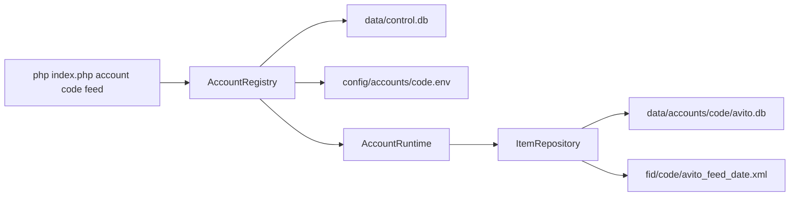

# Масштабирование на много аккаунтов Avito

Отдельная база и отдельный фид на кабинет уже работают. Готовый XML уходит на опубликованный файл Яндекс.Диска этого кабинета (`run`). Отдельный бакет и проекция в Google Sheets в коде ещё нет.

Корневые команды (`php index.php run`, `feed`, `collect-stats`) по-прежнему открывают один контур: `.env`, `data/avito.db`, `fid/`. Этот кабинет в реестр сам не переносится.

## Что есть сейчас

Изоляция физическая. [ItemRepository](../src/Repositories/ItemRepository.php) по-прежнему видит один файл и не знает про `account_id`. `avito_id` и `unique_id` уникальны внутри этого файла.

- Корневой кабинет: `.env`, [config/avito.php](../config/avito.php), `data/avito.db`, `fid/avito_feed_YYYY-MM-DD.xml`.
- Кабинет из реестра: `config/accounts/{code}.env`, `data/accounts/{code}/avito.db`, `fid/{code}/avito_feed_YYYY-MM-DD.xml`.
- [index.php](../index.php) не собирает клиент сам. Команду разбирает [CommandDispatcher](../src/Cli/CommandDispatcher.php), а объекты на один прогон собирает [AccountRuntime](../src/Accounts/AccountRuntime.php).
- Дневной счётчик `app_meta.feed_repub_YYYY-MM-DD` лежит в файле того кабинета, который сейчас открыт.

Сервисы (`AnalysisService`, `FeedGeneratorService`) и репозиторий не переписывались под мультиарендность. Им подставляют другой DSN и другой `feed.output_dir`.

Автозагрузка читает отчёт Авито (`GET /autoload/v4/uploads` в [AvitoAPIClient](../src/Services/AvitoAPIClient.php)). Готовый XML `run` перезаписывает на Яндекс.Диске; публичная ссылка берётся из env кабинета. Кабинет Авито сам забирает файл по URL, отдельной загрузки фида через API нет. Настройка Диска — в [README](../README.md), раздел «Яндекс.Диск».

Корневой запуск ту же схему проходит без реестра: `AccountRuntime::openLegacy` берёт `.env` и `data/avito.db`.

## Паттерны

Оболочка вокруг уже работающих классов. SQL репозитория не стал мультиарендным.

- **AccountContext.** Код, ключи, путь к базе, каталог фида, необязательный `max_daily_repub`. Сервисы читают уже наложенный конфиг, а не чужой `.env`.
- **AccountRegistry.** Метаданные в `data/control.db`. Секреты остаются в env-файле.
- **AccountRuntime.** На один прогон собирает PDO, `AvitoAPIClient`, репозиторий и контроллер. Токен OAuth живёт в этом клиенте и не переходит к следующему кабинету: соединение закрывается до следующей итерации.
- **CommandDispatcher.** Один разбор команд и для корневого запуска, и для `account {code}`.
- **Наложение конфига.** Паузы, пороги и категория фида остаются в `config/avito.php`. Контекст подменяет ключи API, DSN, `feed.output_dir` и каталог скачанной выгрузки. Корневой `fid/autoload/` кабинету из реестра не отдаётся.

Ещё не сделано: интерфейс стратегии отбора кандидатов, выгрузка в отдельный бакет, таблица прогонов `account_runs` и запись в Google Sheets. Яндекс.Диск на кабинет уже есть: ссылка и токен в его env, команды `run` и `run-r`.

## База

Один общий SQLite на 20–50 аккаунтов не берём. Сейчас один писатель, нет `account_id`, а `unique_id` / `avito_id` столкнутся между кабинетами. На 50 аккаунтов при ~8 тыс. объявлений и дневной статистике это десятки миллионов строк и блокировка файла на время `collect-stats`.

Решение на этот масштаб — **файл на аккаунт**, схема внутри файла та же, что уже работает:

- Реестр: `data/control.db`, таблица `accounts` (`code`, `label`, `user_id`, `db_path`, `feed_dir`, `env_file`, `enabled`, `max_daily_repub`, `created_at`). Секретов в ней нет. `user_id` копируется из env при `account list` и при запуске команды. Пустой `max_daily_repub` означает лимит из `config/avito.php`.
- Данные: `data/accounts/{code}/avito.db`. Схема та же, без `account_id`. Файл создаёт `ItemRepository` при первой команде кабинета, не при `account add`. Строки из `data/avito.db` не копируются.
- Секреты: `config/accounts/{code}.env` (в `.gitignore`): ключи Авито и поля Яндекс.Диска. Корневой `.env` остаётся у команд без `account`. Ссылка и токен Диска из корневого файла в кабинет реестра не копируются.
- Код кабинета: `^[a-z0-9][a-z0-9_-]{0,40}$`. Путь базы только внутри `data/accounts/{code}/`, фид только внутри `fid/{code}/`, ключи только в `config/accounts/{code}.env`. Чужой путь из реестра команда не открывает.

Общий Postgres с `account_id` на каждой таблице — следующий шаг, и только если понадобятся одновременные писатели или один SQL по всем кабинетам. Путь миграции: выгрузить каждый файл в схему с `account_id`. До этого момента не смешивать объявления в одной таблице.

Сводка по аккаунтам для Sheets в `control.db` ещё не пишется. Детальная статистика остаётся в файле аккаунта.

## Фиды

Локальные файлы уже разведены:

- Корневой кабинет: `fid/avito_feed_YYYY-MM-DD.xml`.
- Кабинет из реестра: `fid/{code}/avito_feed_YYYY-MM-DD.xml`. Имя файла то же, каталог другой.
- В кабинете Авито у каждого аккаунта свой URL автозагрузки на свой файл. Авито забирает файл сам.

`php index.php account {code} run` пишет `fid/{code}/avito_feed_YYYY-MM-DD.xml` и перезаписывает файл по `YANDEX_DISK_PUBLIC_URL` из env этого кабинета. `run-r` оставляет файл только в `fid/{code}/`. Отдельного бакета нет.

`Id` объявления в фиде уникален внутри аккаунта. Общий файл или общий URL смешает кабинеты: автозагрузка снимет всё, чего в её файле нет.

## Лимиты и расписание

Пауза 8 секунд между запросами уже есть и должна остаться **на клиент аккаунта**. 50 кабинетов подряд с полным `collect-stats` за 30 дней — это часы. Поэтому:

- Планировщик гоняет аккаунты по очереди, не параллельно, пока у них разные `client_id` не проверены на независимые квоты.
- Ежедневный прогон берёт короткое окно статистики (`stats_days`, сейчас 3), не 30.
- Счётчик `feed_repub_*` живёт в файле открытого кабинета и сам не пересекается с другим файлом. Свой `max_daily_repub` можно положить в колонку реестра; пока она пустая, берётся значение из `config/avito.php`. Команды, которая меняет эту колонку, нет.
- `php index.php accounts run` — все `enabled`, по очереди. `php index.php account {code} run` — один. Ошибка одного кабинета не останавливает остальных.

Добавление кабинета и команды — в [README](../README.md), раздел «Несколько аккаунтов».

## Что ещё не сделано

1. Отдельный бакет с постоянным `latest`. Яндекс.Диск на кабинет уже перезаписывает опубликованный файл.
2. Стратегии: вынести текущие пороги в первую стратегию, пайплайн вызывает интерфейс.
3. Проекция в Sheets из будущей `account_runs`.
4. Регистрация текущего кабинета в общий обход с явными путями на уже существующие `data/avito.db` и `fid/`, без копирования файла. Сейчас его запускают только без префикса `account`.
5. Postgres — только если понадобятся одновременные писатели или один SQL по всем кабинетам. До этого объявления в одной таблице не смешивать.
